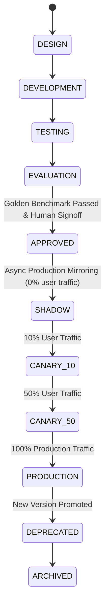

# Agent Versioning & Rollout Lifecycle

## Overview

Agent behaviors, system prompts, tool permissions, and model configurations must be strictly versioned and governed through phased rollout states.

## Version Immutability

Each `AgentVersion` record is immutable once published:
- `agent_key`: Unique system identifier (e.g. `discovery_agent`, `qualification_agent`, `ai_governance_agent`)
- `version`: Semantic version string (e.g. `v1.0.0`, `v1.2.0`)
- `model_key`: Model and provider spec
- `prompt_version`: Associated prompt registry version
- `allowed_tools`: Explicit whitelist of tool names
- `permissions`: Assigned RBAC capabilities
- `configuration`: Hyperparameters (temperature, max_tokens, retry limits)

## Rollout Lifecycle States

## Guardrails: Zero Autonomous Self-Promotion
- `AI_AUTO_DEPLOY=false` is enforced platform-wide.
- Agents and models are strictly prohibited from issuing promotion commands to production.
- Transitions to `APPROVED`, `CANARY`, and `PRODUCTION` require human role authorization.
