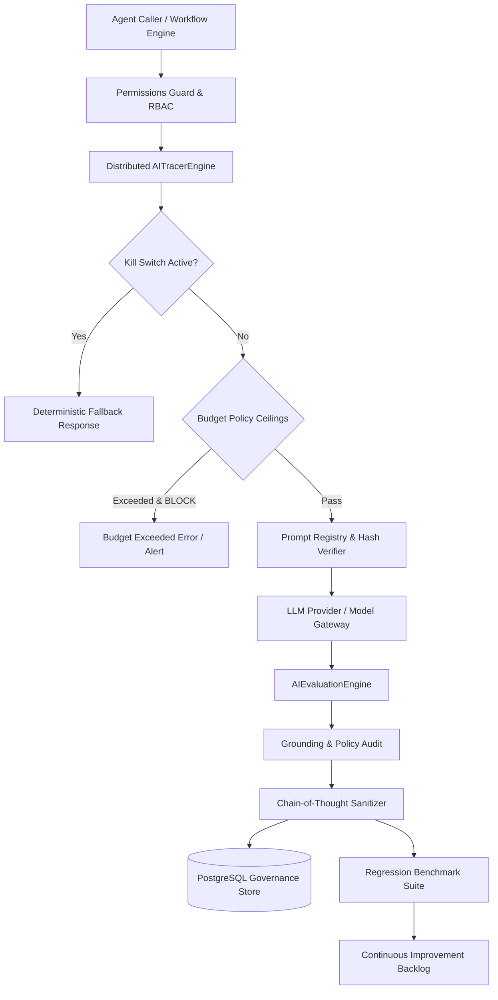

# AI Governance & Observability Architecture

## System Architecture Overview

Phase 33 establishes the unified monitoring, evaluation, versioning, budget control, and safety infrastructure for all AI agents across the platform.

## Architectural Components

### 1. Zero Private Chain-of-Thought (CoT) Storage Engine
- **Policy**: Deep reasoning steps, hidden thoughts, and unscrubbed model monologues are never persisted into PostgreSQL or exposed via REST/GraphQL APIs.
- **Sanitization**: Intercepts all output payloads and sanitizes reserved keys (`thought`, `reasoning`, `chain_of_thought`, `internal_monologue`, `hidden_scratchpad`).
- **Telemetry**: Records sanitized metrics (token counts, duration ms, tool calls, structured assertions, and factual citations).

### 2. Multi-Dimensional Evaluation Engine
- **Factual Grounding**: Verifies semantic overlap between agent outputs and provided reference context to detect hallucinations.
- **Policy Compliance**: Scans for prohibited claims, commitment guarantees, and regulatory violations.
- **Structural Integrity**: Validates schema conformance, required JSON fields, and non-empty responses.
- **Toxicity & Safety**: Detects hostile prompts, jailbreak patterns, and unsafe instructions.

### 3. Golden Regression Test Suite
- Automated evaluation against curated golden datasets across all agent domains.
- Degradation threshold gating: Any aggregate performance drop >5.0% flags `regression_detected=True` and halts automatic progression.

### 4. Independent Emergency Kill Switch
- Multi-tier circuit breaker: `GLOBAL_AI_OFF`, `AGENT_OFF`, `MODEL_OFF`, `WORKFLOW_OFF`, `TOOL_OFF`.
- Read-through state caching in memory/Redis with database persistence.
- Strictly protected under `ACTIVATE_GLOBAL_KILL_SWITCH` human permissions.

### 5. Financial & Token Ceilings
- Per-tenant, per-agent, and global daily/monthly spending quotas.
- Enforcement behaviors: `BLOCK`, `FALLBACK`, `REQUIRE_REVIEW`.
