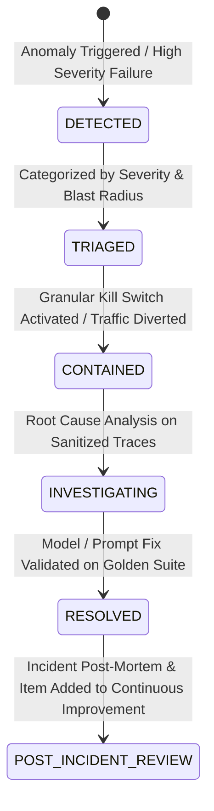

# AI Incident Management & Operational Triage

## Incident Classification & Severity

Operational errors and model failures are categorized under standardized taxonomies (`AIFailureCategory`):

| Failure Category | Description | Auto-Remediation |
| :--- | :--- | :--- |
| `MODEL_ERROR` | Provider 5xx, rate limits, connection drop | Exponential backoff retry with secondary provider |
| `TOOL_ERROR` | Tool execution exception or invalid params | Tool fallback / graceful degradation |
| `TIMEOUT` | P95 latency limit exceeded | Execution abort and fallback response |
| `SCHEMA_ERROR` | JSON structure or type mismatch | Schema repair prompt retry (max 2 attempts) |
| `VALIDATION_ERROR` | Business rule or range assertion failed | Request human review |
| `RISK_BLOCK` | Toxicity, prompt injection, PII leak | Instant block & `AISecurityEvent` log |
| `BUDGET_EXCEEDED` | Cost ceiling breached | Rate-limiting or model downgrade |

## AI Incident Lifecycle

## Human Incident Governance
- All incidents of severity `CRITICAL` or `HIGH` require human signoff for resolution.
- Incident resolutions automatically generate test cases in golden benchmark datasets to prevent recurring regressions.
