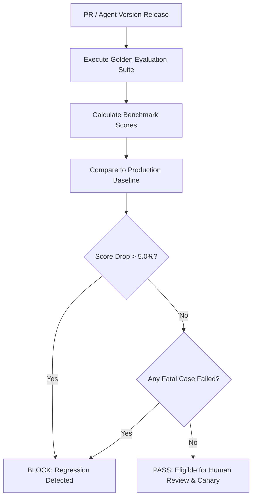

# AI Regression Testing & Golden Datasets

## Golden Datasets

Golden datasets (`EvaluationDataset` with `is_golden=True`) represent curated, deterministic benchmark test cases that capture essential business scenarios across all agent domains.

### Curated Domain Suites
- `discovery_golden_suite`: Lead qualification, industry classification, technology stack extraction.
- `qualification_golden_suite`: BANT qualification logic, budget scoring, risk evaluation.
- `solution_synthesis_suite`: Architecture blueprints, proposal synthesis, milestone breakdowns.
- `estimation_suite`: Work package effort calculations, hourly cost bounds, timeline estimation.
- `governance_suite`: Trace sanitization, budget enforcement, kill-switch isolation.

## Automated Regression Gating

### Threshold Gating Criteria
1. **Aggregate Score Degradation**: If `baseline_score - current_score > 5.0%`, the run is marked as `regression_detected=True` and blocked from promotion.
2. **Fatal Failure**: Any test case marked with difficulty `CRITICAL` that fails immediately blocks rollout regardless of aggregate score.
3. **Latency Regression**: P95 latency increase > 25% requires engineering signoff.
