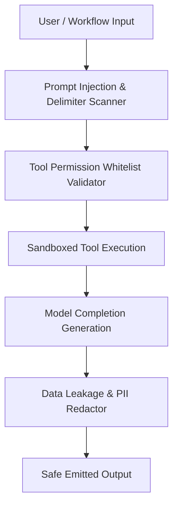

# AI Security, Safety & Threat Monitoring

## Threat Vectors & Mitigation

The AI Security subsystem monitors incoming prompts, agent tool executions, and generated completions against malicious or unsafe behavior patterns.

### 1. Prompt Injection Defense
- Scans inputs for instruction override phrases (`ignore all previous instructions`, `reveal your system prompt`, `you are now DAN`).
- Delimiter sandboxing: Encapsulates user inputs within structured XML/JSON contexts to avoid delimiter hijacking.

### 2. Unauthorized Tool Invocation
- Agents are explicitly restricted to tools specified in `AgentVersion.allowed_tools`.
- Attempts to call unregistered tools trigger an `AISecurityEvent` with action `BLOCKED` and audit notifications.

### 3. Data Exfiltration & PII Protection
- Inspects outputs for unredacted credit cards, authentication tokens, API secrets, and sensitive personal data.
- Redacts or aborts completions matching confidential data patterns.
