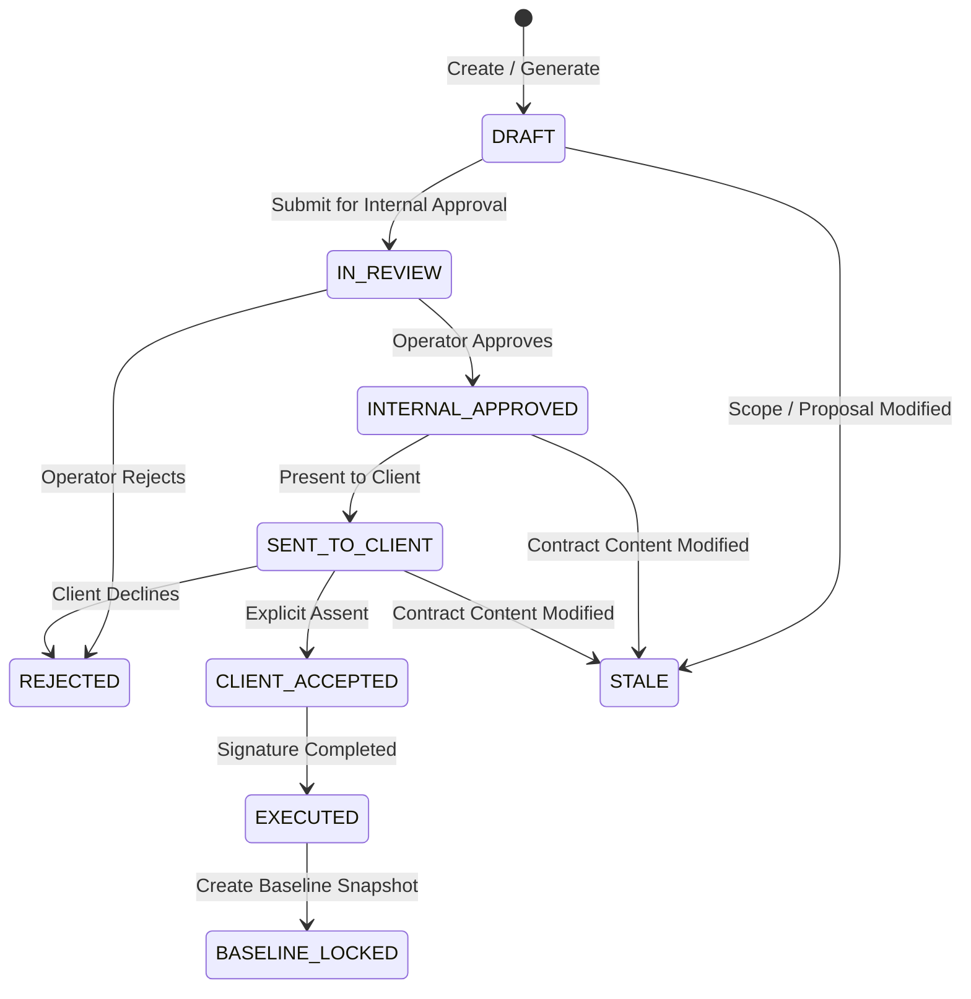

# Contract Lifecycle & State Machine

## Overview
The Contract State Machine enforces strict state transitions and gatekeeper criteria throughout the contract lifecycle.

---

## State Diagram

---

## Contract States & Definitions

| State | Description | Permitted Next Actions |
|---|---|---|
| `DRAFT` | Initial draft created automatically or manually. Completeness and discrepancy evaluation active. | Edit sections, run Risk Evaluation, Submit for Internal Review |
| `IN_REVIEW` | Contract locked pending internal operator approval. | Internal Approve, Internal Reject |
| `INTERNAL_APPROVED` | Approved by internal operator. Content hash locked for this version. | Present/Send to Client, Regenerate/Modify (invalidates approval) |
| `SENT_TO_CLIENT` | Contract made available to client for review. | Record Client Acceptance, Client Reject |
| `CLIENT_ACCEPTED` | Client provided formal assent. Awaiting signature execution. | Execute Signatures |
| `EXECUTED` | All signatures collected. Fully binding agreement. | Lock Committed Baseline Snapshot |
| `BASELINE_LOCKED` | Project committed baseline created. Single source of truth for delivery. | Active Project Execution |
| `REJECTED` | Rejected by operator or client. | Create New Version / Draft |
| `STALE` | Contract content or underlying proposal/estimate modified after approval/sent state. | Re-evaluate Risk & Resubmit for Review |
| `CANCELLED` | Aborted agreement. | Archival |

---

## Transition Rules & Validation Guards

1. **Internal Approval Guard**: `IN_REVIEW` $\rightarrow$ `INTERNAL_APPROVED` requires:
   - Completeness score $\ge 70.0$.
   - Risk score $\ge 0.85$ (Phase 20 Risk Engine).
   - Zero unresolved critical discrepancies.
   - User holding `APPROVE_CONTRACT` permission (Operators only; Agent forbidden).

2. **Client Acceptance Guard**: `SENT_TO_CLIENT` $\rightarrow$ `CLIENT_ACCEPTED` requires:
   - Contract in `SENT_TO_CLIENT` or `INTERNAL_APPROVED` state.
   - Non-empty client IP address, timestamp, acceptance statement, and signer identity.
   - Note: Client viewing or opening the document does **NOT** trigger state transition.

3. **Baseline Locking Guard**: `EXECUTED` $\rightarrow$ `BASELINE_LOCKED` requires:
   - Active execution status with verified signature provider confirmation.
   - Generation of immutable `ContractBaseline` entity locking total price, currency, SLA terms, delivery milestones, and scope items.
