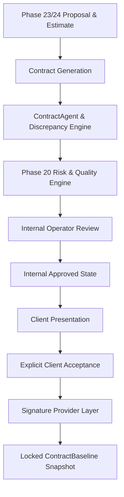

# Contract & Scope Commitment System Architecture

## Overview
The Contract & Scope Commitment System in **Uzaii Develop By North's** is the formal governance layer that transitions approved proposals, commercial estimates, and solution designs into legally auditable contract drafts, operator approvals, client acceptances, and immutable committed project baselines.

---

## Core Operational Principles

### 1. Proposal $\neq$ Client Acceptance $\neq$ Contract $\neq$ Signature $\neq$ Project Baseline
* **Proposal**: A recommended solution design, scope definition, and preliminary estimate.
* **Contract**: A formal agreement draft specifying deliverables, pricing terms, SLA parameters, payment milestones, liabilities, and intellectual property terms.
* **Client Acceptance**: An explicit, legal act of assent by an authorized client representative accepting specific contract terms.
* **Signature**: Digital or cryptographic signature binding the agreement (governed by mock or real signature providers).
* **Project Baseline**: An immutable snapshot (`ContractBaseline`) locked upon execution, serving as the single source of truth for downstream execution, change orders, and milestone verification.

### 2. Autonomous Guardrails & AI Agent Limitations
`ContractAgent` is an automated assistant designed to evaluate completeness, detect scope/cost discrepancies, and draft contract sections from structured proposals and requirements. However:
* `ContractAgent` holds **ZERO** permissions to approve contracts, accept terms on behalf of clients, sign contracts, send emails, or alter pricing policies (`SEND_EMAIL`, `SEND_MESSAGE`, `APPROVE_CONTRACT`, `ACCEPT_CONTRACT`, `SIGN_CONTRACT`, `SEND_CONTRACT`, `EXECUTE_CONTRACT` strictly prohibited).
* All contract approvals require explicit human operator review.
* All contract acceptances require explicit client interaction.

### 3. Risk Engine Integration
Every draft contract version is evaluated by the centralized **Risk & Quality Engine** (Phase 20) before internal operator approval. If the Risk Engine assigns a score $< 0.85$ or identifies critical violations (unbounded liability, missing payment milestones, policy non-compliance), the contract state is marked `RISK_REJECTED` or flagged for mandatory remediation.

---

## Architecture Blueprint

---

## Content Integrity & Version Control
1. **SHA-256 Content Hashing**: Every `ContractVersion` computes an immutable SHA-256 hash over its canonical ordered sections structure.
2. **Stale Invalidation**: Any content edit increments the contract version ($v \rightarrow v+1$), generates a new content hash, resets any prior approvals, and sets status back to `DRAFT`.
