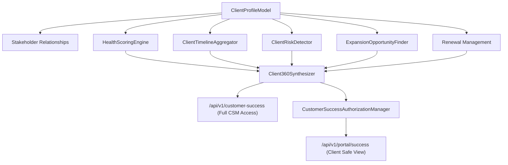

# Unified Customer Success Architecture

## System Diagram

## Data Isolation & Multi-Tenancy

Every customer success entity is explicitly partitioned by `tenant_id` and indexed on `client_profile_id` (or `client_account_id`). Foreign key constraints ensure cascading consistency while enforcing strict organization isolation.
