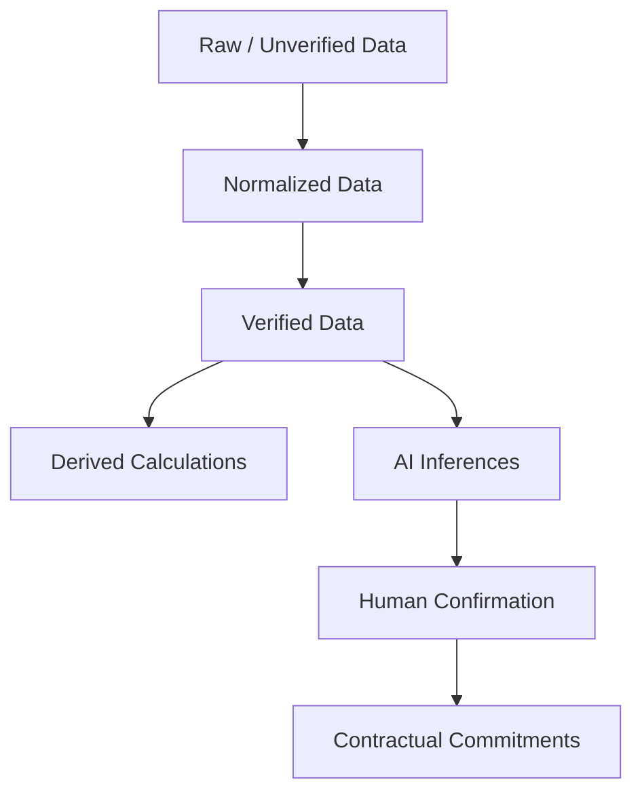

# Data Architecture & Semantic Authority

## Core Principles

The enterprise data platform enforces strict authority tiers to prevent the conflation of raw unverified observations with contractual commitments.

## Authority Levels

| Tier | Enum Value | Description | Permitted Usages |
| :--- | :--- | :--- | :--- |
| **1. Raw Data** | `RAW_DATA` / `UNVERIFIED` | Raw crawler observations, unvalidated webhook payloads | Ingestion pipelines, exploratory analytics |
| **2. Normalized** | `NORMALIZED_DATA` / `DERIVED` | Cleaned and schema-conformed records | Domain processing, entity scoring |
| **3. Verified** | `VERIFIED_DATA` / `VERIFIED` | Validated by authoritative sources or platform checks | Master catalog, production decision engines |
| **4. Derived** | `DERIVED_DATA` | Mathematical calculations or deterministic transformations | Financial models, timelines, risk indexes |
| **5. AI Inference** | `AI_INFERENCE` / `INFERRED` | Machine learning or LLM output | Draft recommendations, proposals, suggestions |
| **6. Human Confirmation**| `HUMAN_CONFIRMATION` / `CONFIRMED` | Explicit human sign-off or approval gate | Production baselines, client-facing quotes |
| **7. Contractual** | `CONTRACTUAL_COMMITMENT` / `AUTHORITATIVE` | Signed agreements, legal baselines | Binding scopes, warranties, SLAs |

## Tenant Isolation & ABAC Clearance

Data access requires matching tenant bounds (`tenant_id = principal.tenant_id`) and clearance matching the classification tier:
- `PUBLIC`: Accessible by all principals.
- `INTERNAL`: Accessible by internal team members and authenticated tenants.
- `CONFIDENTIAL`: Accessible by authorized tenant roles (LEAD, ADMIN, OWNER).
- `RESTRICTED`: Accessible only by compliance officers and system owners.
