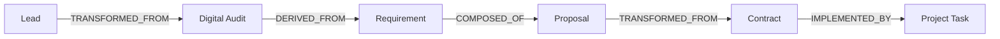

# Data Lineage, Documents, Knowledge & Retention Architecture

## 1. Lineage Graph & Provenance

The lineage graph tracks how every artifact is generated, transformed, and delivered:

- **Upstream Tracing**: Answers where an estimate, requirement, or proposal originated.
- **Downstream Tracing**: Identifies all dependent downstream models impacted if upstream requirements change.

## 2. Immutable Documents & SHA-256 Checksums

All formal business documents (MSAs, Proposals, Specifications, Change Baselines) are saved with deterministic SHA-256 integrity hashes:
- Checksum computed on creation and stored in `DocumentRecord.latest_sha256`.
- Every revision increments `version_number` and appends an immutable `DocumentVersionRecord`.
- Tamper verification compares `hashlib.sha256(content).hexdigest()` against recorded checksums.

## 3. Knowledge Base & Promotion Lifecycle

Knowledge items follow a disciplined lifecycle:
`INGESTED` (Draft) $\rightarrow$ `INDEXED` (Review) $\rightarrow$ `VERIFIED` (Confirmed) $\rightarrow$ `CANONICAL` (Active) $\rightarrow$ `DEPRECATED` / `ARCHIVED`.

- **Promotion Permissions**: Promotion to `CANONICAL` requires `LEAD`, `ADMIN`, or `OWNER` role.
- **Context Injection Boundary**: AI agents only retrieve knowledge items matching tenant boundaries and user classification clearance.

## 4. Retention Schedules & Legal Holds

- **Retention Policies**: Enforce retention windows per domain (e.g. Audit Logs: 365 days; Project Delivery: 730 days) with automated expiry actions (`ARCHIVE`, `DELETE`, `ANONYMIZE`).
- **Legal Holds**: Active legal holds strictly block and override deletion operations across all targeted entities until explicitly released.
