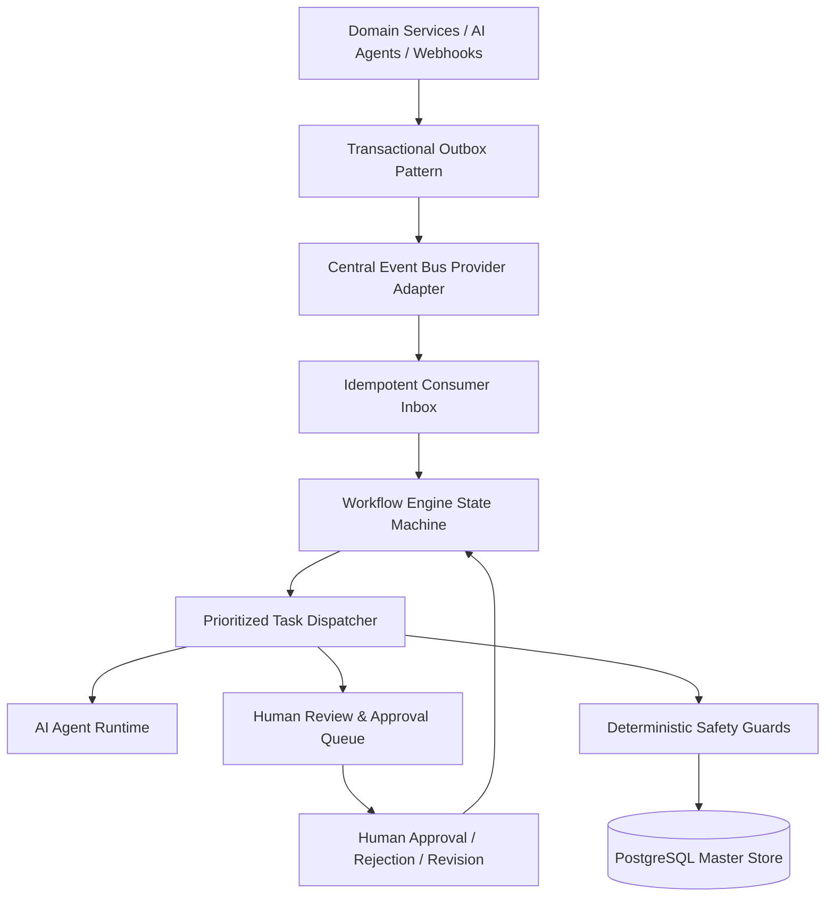

# Unified Workflow Orchestration & Event Control Plane Architecture

## System Overview

Phase 34 implements the central nervous system connecting all 33 previous phases of **Uzaii Develop By North's**.

## Architectural Decoupling

The platform strictly isolates:
- **Events**: Immutable records of completed facts (`occurred_at`, `payload`, `correlation_id`).
- **Commands**: Requests for future actions that may fail or require authorization.
- **Workflows**: Declarative directed acyclic graphs (DAGs) coordinating business steps.
- **Agents**: Autonomous intelligence producing candidate drafts within bounded permissions.
- **Human Approvals**: Explicit human decision gates for sensitive actions.
- **Safety Guards**: Deterministic business rules (CommunicationGuard, RiskEngine, KillSwitch).
