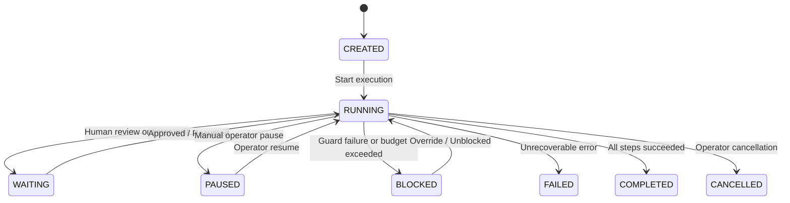

# Declarative Workflow Engine & State Machine

## Workflow State Machine

Workflows and individual steps transition through formal, deterministic state machines.

## Built-In Business Templates

1. **Lead Acquisition & Outbound Pipeline (`lead_acquisition_workflow`)**:
   - `discovery` $\rightarrow$ `research` $\rightarrow$ `audit` $\rightarrow$ `qualify` $\rightarrow$ `recommend` $\rightarrow$ `personalize` $\rightarrow$ `risk_check` $\rightarrow$ `human_approval` $\rightarrow$ `send_outreach`.
2. **Client Discovery & Contract Pipeline (`client_conversion_workflow`)**:
   - `response_intel` $\rightarrow$ `requirements_extract` $\rightarrow$ `requirements_confirm` $\rightarrow$ `solution_design` $\rightarrow$ `estimation` $\rightarrow$ `proposal_synthesis` $\rightarrow$ `proposal_approval` $\rightarrow$ `contract_generation`.
3. **Project Delivery, QA & Handover (`project_delivery_workflow`)**:
   - `project_init` $\rightarrow$ `qa_test_run` $\rightarrow$ `uat_session` $\rightarrow$ `package_delivery` $\rightarrow$ `final_handover`.
4. **Scope & Commercial Change Governance (`change_management_workflow`)**:
   - `change_classification` $\rightarrow$ `impact_analysis` $\rightarrow$ `internal_approval` $\rightarrow$ `client_approval` $\rightarrow$ `baseline_update`.
5. **AI Evaluation & Regression Gate (`ai_evaluation_workflow`)**:
   - `run_benchmark` $\rightarrow$ `regression_gate` $\rightarrow$ `backlog_sync`.
