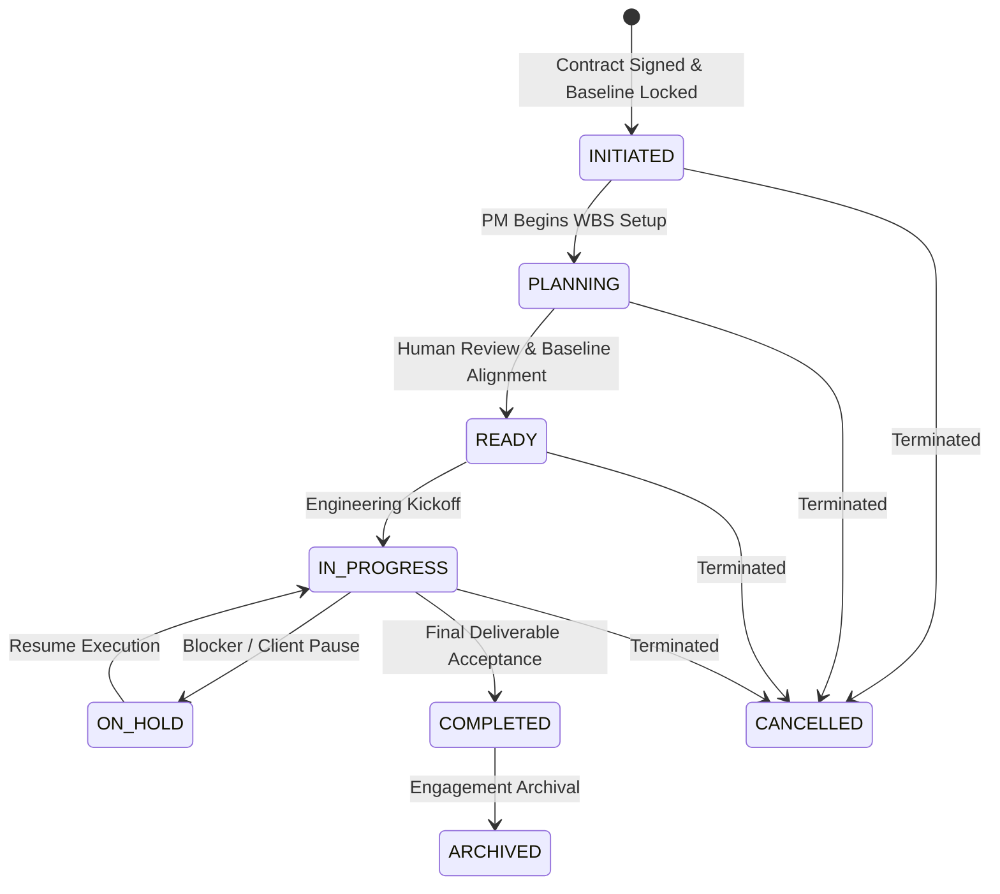

# Project Lifecycle & State Machine

## Overview
The Project State Machine governs the transition of delivery projects from initiation to completion.

---

## State Diagram

---

## Project States & Transition Guardrails

| State | Description | Transition Prerequisites |
|---|---|---|
| `INITIATED` | Automatically created upon contract baseline locking. | Valid `Contract` & `ContractBaseline` linked. |
| `PLANNING` | PM and `ProjectAgent` constructing WBS tasks, milestones, and dependencies. | Owner assigned. |
| `READY` | WBS plan approved by human PM. Ready for engineering kickoff. | Human PM review completed. |
| `IN_PROGRESS` | Active engineering delivery. | Actual start timestamp recorded. |
| `ON_HOLD` | Execution paused due to unresolved blockers or client hold. | Health updated to `BLOCKED`. |
| `COMPLETED` | All deliverables accepted and overall progress = $100\%$. | All tasks & deliverables accepted. |
| `CANCELLED` | Aborted project. | Operator action. |
| `ARCHIVED` | Archived historical engagement. | Project in `COMPLETED` or `CANCELLED` state. |
