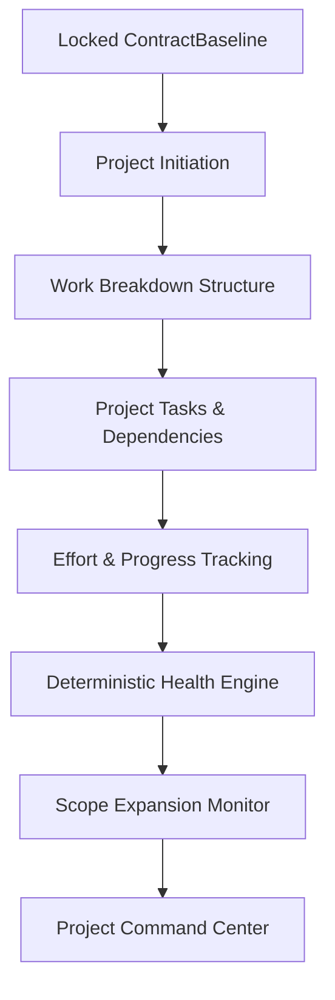

# Project Initiation & Delivery Execution System Architecture

## Overview
The Project Initiation & Execution Management System in **Uzaii Develop By North's** is the operational layer that converts signed contracts (`Contract`) and committed project baselines (`ContractBaseline`) into structured internal delivery projects (`Project`), Work Breakdown Structures (WBS), tasks, milestones, deliverables, risks, blockers, and deterministic project health monitoring.

---

## Core Execution Principles

### 1. Execution Respects the Committed Baseline
> *Execution operates against the approved baseline; execution does not silently redefine or alter the baseline.*

```text
Contract Scope
       ↓
Committed Baseline (Phase 25)
       ↓
Execution Planning (Phase 26)
       ↓
Tasks & Milestones
       ↓
Engineering Delivery
```

### 2. Scope Expansion Protection
When new features or changes are requested during execution:
```text
Client Request / New Feature
       ↓
Project Scope Monitor Engine
       ↓
Scope Signal Detected (NEW_SCOPE_REQUEST)
       ↓
Human Operator & Change Order Review (No Auto-Approval)
```

### 3. AI Project Assistant & Human-in-the-Loop Control
`ProjectAgent` (v1.0) provides WBS draft suggestions, risk analysis, progress metrics, and executive status summaries, but holds **ZERO** permissions to approve scope changes, alter baseline commitments, modify pricing, promise delivery dates, or send external communications (`MODIFY_BASELINE`, `CHANGE_CONTRACT`, `CHANGE_PRICE`, `APPROVE_SCOPE`, `APPROVE_CHANGE`, `SEND_EXTERNAL_MESSAGE`, `PROMISE_DEADLINE` are strictly prohibited).

---

## High-Level Architecture Diagram


