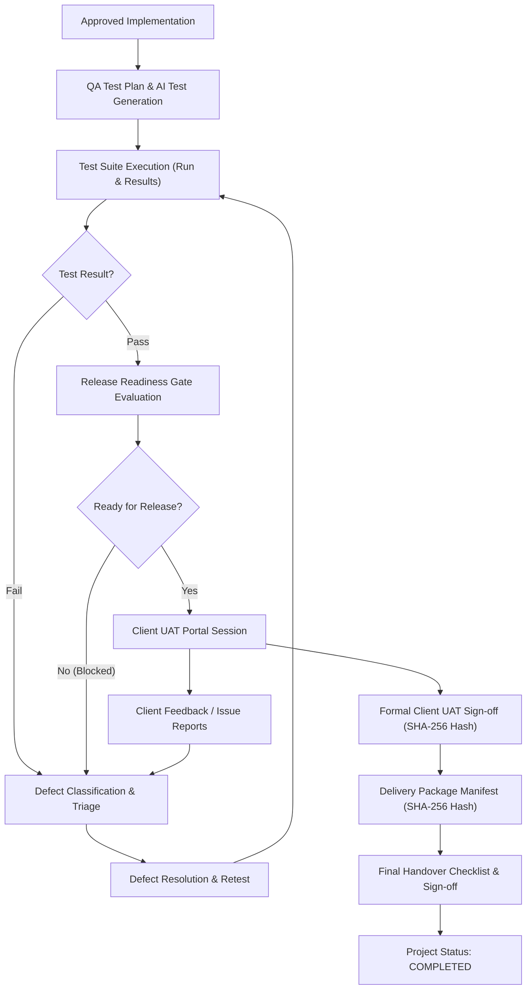

# Phase 29 — Quality Assurance, UAT, Delivery Acceptance & Handover System Architecture

## 1. Executive Overview

Phase 29 closes the controlled delivery loop of the **Uzaii Develop By North's** platform.

It establishes a production-grade QA, defect tracking, client UAT, release readiness gate, delivery packaging, SHA-256 client acceptance, and structured handover system.

### Core Governance Principles:
- **Strict Distinction of Delivery States**: `Built` $\neq$ `Tested` $\neq$ `UAT Approved` $\neq$ `Delivered` $\neq$ `Accepted` $\neq$ `Handed Over` $\neq$ `Completed`. Each state requires explicit evidence and authorization.
- **Defect vs. Scope Change Separation**: Defect represents non-compliance with the approved baseline contract specification. Any request introducing new features or modifying baseline requirements is classified as a **Scope Change (Phase 28)** and cannot be closed as a bug.
- **Zero AI Approval Authority**: `QAAgent` holds **ZERO** permissions to approve UAT, accept deliverables, close critical defects, release code, or complete handover. Human authorization is mandatory.
- **Deterministic Quality Gates**: Failing critical tests or open critical defects strictly block release deployment, overriding any AI predictions or readiness scores.

---

## 2. System Architecture

---

## 3. Data Model Summary (13 ORM Entities)

1. `TestPlan`: Test strategy, environments, and scope definition.
2. `TestCase`: Reusable test case steps, preconditions, expected results, category, and regression flags.
3. `TestRun`: Execution session tracking environment, passed, failed, blocked, and skipped test counts.
4. `TestResult`: Individual test case execution result and notes.
5. `TestEvidence`: Attached screenshots, logs, or SHA-256 hashed evidence artifacts.
6. `Defect`: Flaw entity tracking severity (CRITICAL, HIGH, MEDIUM, LOW), priority, status, and classification.
7. `UATSession`: Formal client UAT session tracking scheduled windows and client approval state.
8. `UATFeedback`: Structured client feedback or issue reports submitted during UAT.
9. `AcceptanceCriteria`: Deliverable-level acceptance criteria verification.
10. `ReleaseVersion`: Production release candidate tracking version tag, target environment, and gate status.
11. `DeliveryPackage`: Registered delivery artifact package with file size and SHA-256 checksum.
12. `HandoverChecklist`: Final project checklist (code repo, docs, credentials, training, deployment verification) and SHA-256 sign-off.
13. `QAEvent`: Immutable audit trail log for QA and handover events.
