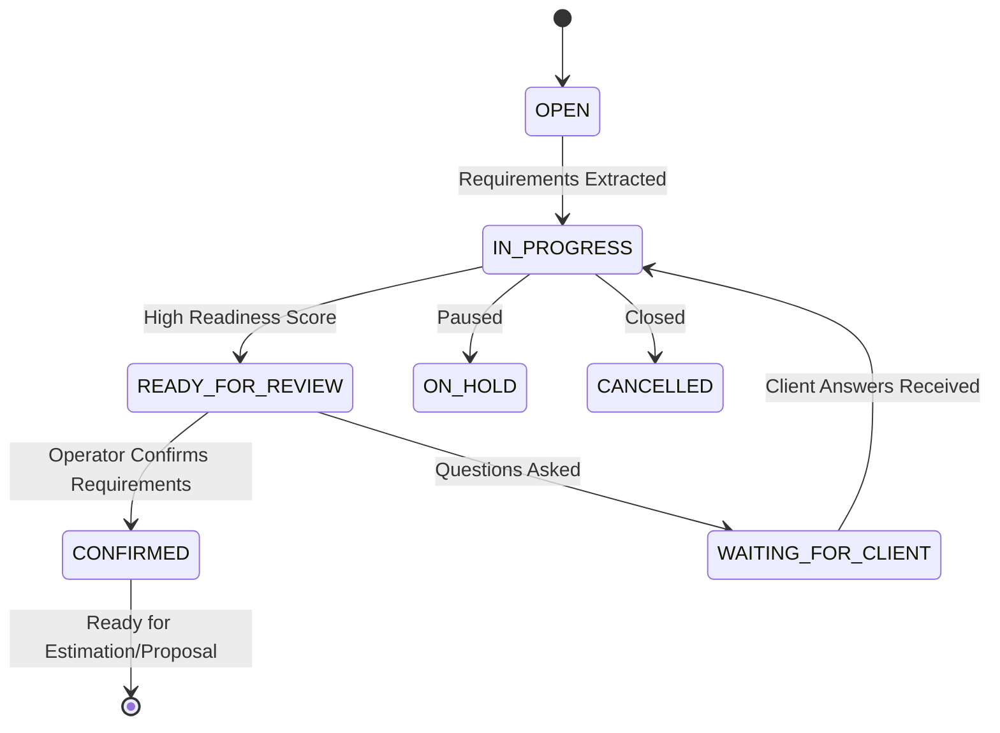

# Discovery Sessions & Lifecycle Architecture

## 1. Discovery Lifecycle States

Each discovery session progresses through formal lifecycle states:

---

## 2. Session Schema (`discovery_sessions`)

- `id`: UUID Primary Key.
- `business_id`: Foreign key to `businesses.id`.
- `lead_id`: Foreign key to `leads.id`.
- `conversation_id`: Foreign key to `conversations.id`.
- `status`: Session state (`OPEN`, `IN_PROGRESS`, `WAITING_FOR_CLIENT`, `READY_FOR_REVIEW`, `CONFIRMED`, `ON_HOLD`, `CANCELLED`).
- `started_at`, `completed_at`: Timestamps.
- `readiness_stage`: Overall stage (`NOT_READY`, `PARTIALLY_READY`, `READY_FOR_REVIEW`, `READY_FOR_NEXT_STAGE`).
- `readiness_score`: Quantitative score from 0.0 to 100.0.
- `completeness_score`: Requirement category coverage percentage (0.0 to 100.0).
- `scope_complexity`: Scope complexity tier (`LOW`, `MEDIUM`, `HIGH`, `UNKNOWN`).
- `version`: Version integer incremented on analysis or update.
