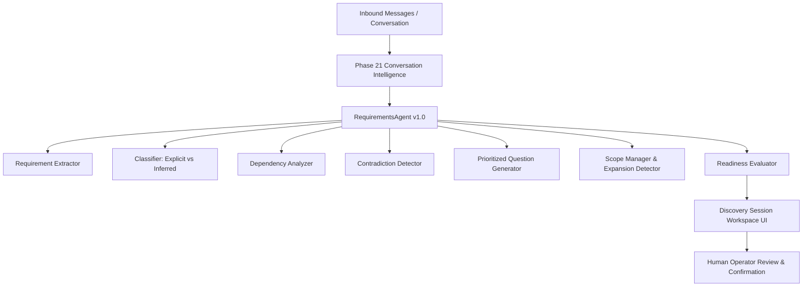

# Phase 22 — Client Requirements & Discovery Intelligence System Overview

## 1. Executive Summary

The **Client Requirements & Discovery Intelligence System** converts raw client messages and conversation history (from Phase 21) into structured, evidence-backed project requirements. It provides a formal, uncompromised distinction between what the client explicitly stated, what the AI inferred, and what an authorized human operator confirmed.

> **Core Policy**: Explicit Evidence & Human Agency. AI inferences are tagged `source: AI_INFERENCE`, `explicit: false`, and `status: PROPOSED`. They are **NEVER** automatically converted to `CONFIRMED` requirements without explicit human or client confirmation.

---

## 2. Architecture & Dataflow

---

## 3. Core Operational Capabilities

| Subsystem | Description | Key Component |
| :--- | :--- | :--- |
| **Discovery Session Engine** | Tracks the discovery lifecycle (`OPEN`, `IN_PROGRESS`, `READY_FOR_REVIEW`, `CONFIRMED`). | `DiscoverySession` ORM model & `RequirementsService` |
| **Requirement Extraction** | Multi-source requirement extractor identifying business goals, problems, target users, and features. | `RequirementExtractor` |
| **Classification & Policy** | Distinguishes explicit client requests from AI inferences and assigns priority tiers. | `RequirementClassifier` |
| **Dependency Analyzer** | Builds relationship graphs between scope items (`REQUIRES`, `ENHANCES`, `CONFLICTS_WITH`). | `DependencyAnalyzer` |
| **Contradiction Detector** | Flags conflicting requirement rules (e.g. access control or timeline/scope mismatches). | `ContradictionDetector` |
| **Question Generator** | Produces non-technical, prioritized discovery questions to fill critical gaps. | `DiscoveryQuestionGenerator` |
| **Scope Matrix Manager** | Categorizes features into `IN_SCOPE`, `OUT_OF_SCOPE`, `OPTIONAL`, or `UNKNOWN`. | `ScopeManager` |
| **Readiness Evaluator** | Computes separate `readiness_score` and `completeness_score` metrics. | `ReadinessEvaluator` |

---

## 4. DB Model Relations

- `discovery_sessions`: Linked to `Business`, `Lead`, `Conversation`, and `User`.
- `requirements`: Stores extracted title, category, source type, confidence, explicit flag, status, and confirmation timestamps.
- `requirement_evidence`: Traceable text snippets linking requirements to source messages.
- `requirement_dependencies`: Directed dependency relationships between requirements.
- `requirement_questions`: Prioritized clarification questions with answer tracking.
- `scope_items`: Categorized scope matrix items (`IN_SCOPE`, `OUT_OF_SCOPE`, `OPTIONAL`, `UNKNOWN`).
- `discovery_events`: Complete audit trail of discovery events.
