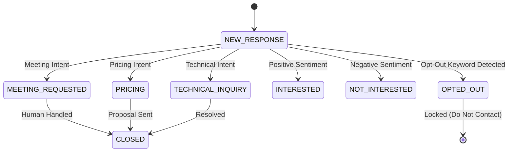

# Conversation Architecture & Deterministic Resolution

## 1. Resolution Lifecycle

When an inbound webhook payload arrives via `/api/v1/webhooks/{provider}`, the `ConversationResolver` resolves or creates the required parent CRM hierarchy:

1. **Contact Match**: Match `sender_email` or `sender_phone` against existing `Contact` records in CRM.
2. **Lead / Business Fallback**: If no Contact exists, match `sender_email` domain or email against `Lead` or `Business`.
3. **Hierarchy Creation**: If no existing CRM records match, automatically create a new `Business`, `Lead`, and `Contact` record with source `INBOUND_MESSAGE`.
4. **Conversation Lookup / Creation**: Retrieve the active open `Conversation` for the `lead_id` / `contact_id`. If none exists, create a new `Conversation` record.

---

## 2. Conversation State Machine

---

## 3. Database Schema Extensions

### `conversations` Table Extensions
- `current_intent`: Latest primary intent string (e.g. `REQUEST_FOR_MEETING`).
- `conversation_stage`: Operational conversation stage (e.g. `MEETING_REQUESTED`, `PRICING`, `OPTED_OUT`).
- `next_action`: Recommended next step (`SCHEDULE_MEETING`, `SEND_PROPOSAL`, `ANSWER_QUESTIONS`).
- `priority`: Priority classification (`HIGH`, `NORMAL`, `LOW`).
- `last_inbound_at`: Timestamp of latest incoming message.

### `conversation_analyses` Table
- `conversation_id`: Foreign key to `conversations`.
- `message_id`: Foreign key to `messages`.
- `primary_intent`, `all_intents`: Intent analysis.
- `intent_confidence`: Float confidence score (0.0 to 1.0).
- `buying_signal`: Commercial readiness evaluation JSON.
- `objection`: Objection classification JSON.
- `extracted_requirements`: List of extracted technical/service needs JSON.
- `missing_information`: Missing details needed to satisfy request.
- `recommended_next_action`, `recommended_next_action_reason`: AI recommendation.
- `next_action_confidence`: Action recommendation confidence score.
- `draft_subject`, `draft_body`: AI-generated response proposal.
- `human_correction`: JSON of operator overrides.
- `human_correction_by_id`: User UUID who performed override.
