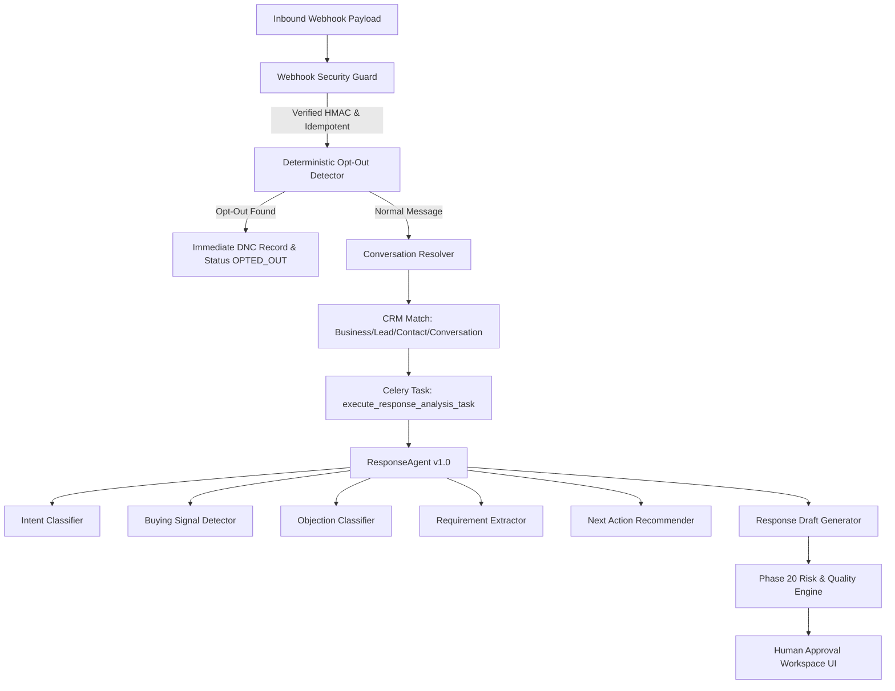

# Phase 21 — Response & Conversation Intelligence System Overview

## 1. Executive Summary

The **Response & Conversation Intelligence System** introduces inbound communication handling and conversational analysis to the **Uzaii Develop By North's** platform. It processes incoming messages across multiple channels (Email, WhatsApp, SMS, LinkedIn), maps them to CRM entities, detects intent, extracts structured requirements and buying signals, recommends next operational actions, and prepares human-reviewable response drafts evaluated by the **Phase 20 Risk & Quality Engine**.

> **Core Policy**: Zero Autonomous Sending. All outbound responses generated by the system require explicit human review and approval (`APPROVED` state) before dispatch.

---

## 2. Key Architecture Components

---

## 3. Core Operational Capabilities

| Capability | Description | Core Class / Service |
| :--- | :--- | :--- |
| **Inbound Webhook Guard** | Verifies HMAC signatures, enforces 5-min timestamp window, deduplicates events. | `WebhookSecurityGuard` |
| **Opt-Out Engine** | Deterministically identifies opt-out keywords (`STOP`, `unsubscribe`, `don't contact me`) and halts communication. | `DeterministicOptOutDetector` |
| **Conversation Resolution** | Maps incoming phone/email/channel address to existing `Business`, `Lead`, `Contact`, and `Conversation`. | `ConversationResolver` |
| **Response Agent (v1.0)** | Phase 14 `BaseAgent` orchestrating multi-dimensional message analysis and draft generation. | `ResponseAgent` |
| **Intent Classification** | Pattern-based classification into 10 structured intent categories with confidence scores. | `IntentClassifier` |
| **Buying Signal & Objection Detection** | Identifies commercial readiness signals (`STRONG`, `MODERATE`) and objections (`PRICE`, `TIMING`, `COMPETITOR`). | `BuyingSignalDetector`, `ObjectionClassifier` |
| **Requirements Extraction** | Extracts explicit service needs and flags missing information required for proposal. | `RequirementExtractor` |
| **Risk-Evaluated Drafts** | Generates response drafts and routes through Phase 20 Risk Engine (`PENDING_APPROVAL`). | `ResponseDraftGenerator`, `RiskEngine` |
| **Human Correction Audit** | Operators can override intent or next action, persisting full correction audit trails. | `ResponseService.record_human_correction` |

---

## 4. DB Model Relations

- `conversations`: Extended with `current_intent`, `conversation_stage`, `next_action`, `priority`, and `last_inbound_at`.
- `inbound_event_logs`: Raw payload audit and processing idempotency tracking.
- `conversation_analyses`: AI intelligence breakdown (intent, buying signals, objections, requirements, recommended next action, draft subject & body, human correction audit).
- `conversation_facts`: Structured key-value knowledge extracted from conversation history.
